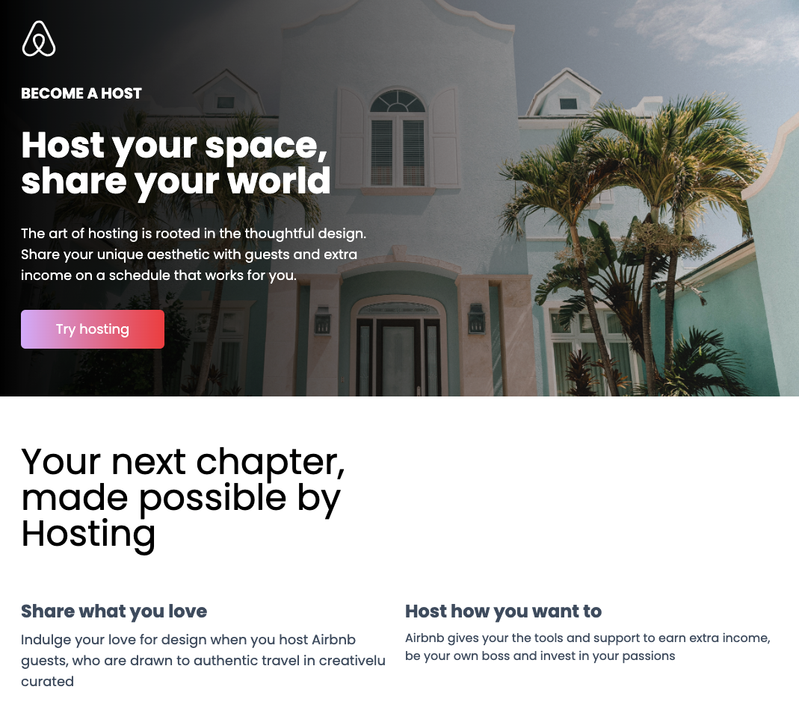

# Airbnb Mock Landing Page

<!-- TABLE OF CONTENTS -->

  
Table of Contents

  - [About The Project](#about-the-project)
  - [Demo](#demo)
  - [Built With](#built-with)
  - [Screenshots](#screenshots)

## About The Project
A simple mockup of an Airbnb landing page constructed fully with React and TailwindCSS

## Demo
- Live Page: https://alvaroormeno.github.io/travel-rental-landing-page/
- Github Repo: https://github.com/alvaroormeno/travel-rental-landing-page

## Built With 
- [HTML](https://developer.mozilla.org/en-US/docs/Web/HTML)
- [CSS](https://developer.mozilla.org/en-US/docs/Web/CSS)
- [JavaScript](https://developer.mozilla.org/en-US/docs/Web/JavaScript)
- [React.js](https://reactjs.org/)
- [TailwindCSS](https://tailwindcss.com/)

## Screenshots

